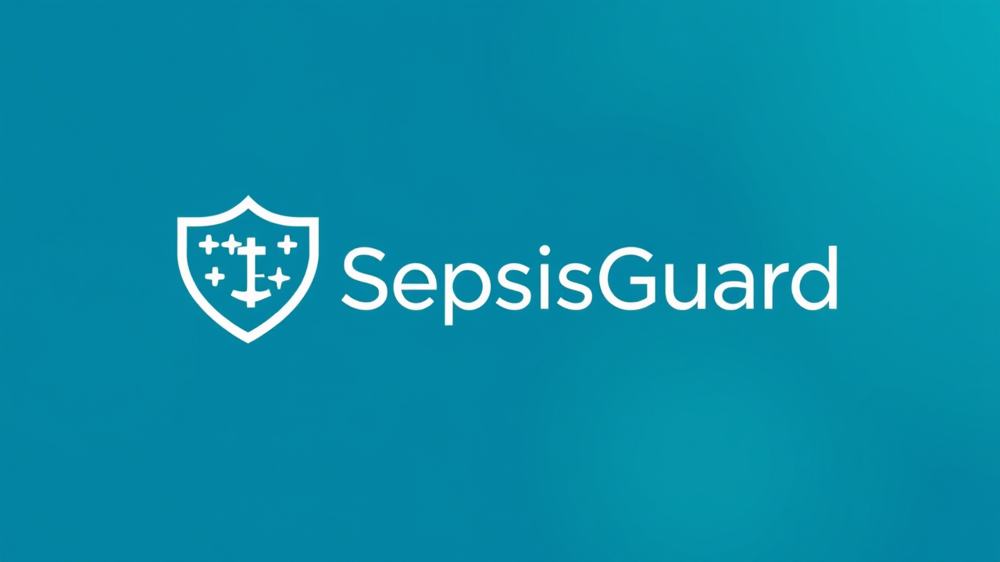

# **SepsisGuard**




## **Overview**

Pediatric sepsis is a life-threatening condition that requires early detection and timely intervention to improve patient outcomes. The **SepsisGuard** leverages machine learning algorithms to predict sepsis in pediatric patients admitted to the Pediatric Intensive Care Unit (PICU). By analyzing clinical data such as lab measurements, drug exposure, demographics, and other time-series features, this system aims to provide accurate predictions up to 6 hours before the onset of sepsis symptoms.

This repository contains the complete implementation of the PSEPS, including data preprocessing, model training, evaluation, and submission generation for predicting sepsis labels in a test dataset.

---

## **Table of Contents**

1. [Project Description](#project-description)
2. [Dataset Description](#dataset-description)
3. [Installation](#installation)
4. [Directory Structure](#directory-structure)
5. [Usage](#usage)
6. [Evaluation Metrics](#evaluation-metrics)
7. [Contributing](#contributing)
8. [License](#license)

---

## **Project Description**

The goal of this project is to develop a machine learning pipeline to predict pediatric sepsis using retrospective registry data from the PICU of Hospital Sant Joan de Déu. The dataset includes multiple categories of patient information, such as demographics, lab measurements, drug exposure, medical devices, and observations. The system preprocesses the raw data, trains a Random Forest classifier, and generates predictions for a test dataset .

Key Features:
- **Data Preprocessing**: Handles missing values, encodes categorical variables, and aggregates time-series data.
- **Model Training**: Trains a Random Forest classifier optimized for predicting sepsis.
- **Prediction Generation**: Generates predictions for the test dataset and formats them into a submission file.
- **Scalability**: Modularized code structure allows for easy integration of new datasets or models.

---

## **Dataset Description**

The dataset is sourced from a retrospective registry of pediatric patients admitted to the PICU. It is split into two subsets: **training data** and **testing data**. Each subset contains the following files:

### **Files Provided**
1. **Outcome File**:
   - `SepsisLabel_{train|test}.csv`: Contains the outcome (`SepsisLabel`) for each patient at every hour. In the test set, the `SepsisLabel` column is omitted, and participants are required to predict it.

2. **Predictor Data Files**:
   - `devices_{train|test}.csv`: Tracks the usage of medical devices.
   - `drugsexposure_{train|test}.csv`: Records drug administration details.
   - `measurement_lab_{train|test}.csv`, `measurement_meds_{train|test}.csv`, `measurement_observation_{train|test}.csv`: Contain lab measurements and medication-related data.
   - `person_demographics_episode_{train|test}.csv`: Provides demographic information.
   - `proceduresoccurrences_{train|test}.csv`: Lists procedures performed during the episode.

For more details, refer to the [Dataset Description](#dataset-description) section.

---

## **Installation**

### **Prerequisites**
- Python 3.9+
- Required libraries: `pandas`, `numpy`, `scikit-learn`, `lightgbm`, `tqdm`

### **Steps**
1. Clone the repository:
   ```bash
   git clone https://github.com/yourusername/pediatric-sepsis-prediction.git
   cd pediatric-sepsis-prediction
   ```

2. Install dependencies:
   ```bash
   pip install -r requirements.txt
   ```

3. Download the dataset and place it in the `data/` folder:
   ```
   data/
   ├── training_data/
   │   ├── SepsisLabel_train.csv
   │   ├── devices_train.csv
   │   └── ...
   ├── testing_data/
       ├── SepsisLabel_test.csv
       ├── devices_test.csv
       └── ...
   ```

---

## **Directory Structure**

```
pediatric-sepsis-prediction/
├── .github/workflows/
│   └── ci-cd.yml
├── data/
│   ├── training_data/
│   │   ├── SepsisLabel_train.csv
│   │   ├── devices_train.csv
│   │   └── ...
│   └── testing_data/
│       ├── SepsisLabel_test.csv
│       ├── devices_test.csv
│       └── ...
├── src/
│   ├── data_loader.py
│   ├── preprocessing.py
│   ├── modeling.py
│   └── utils.py
├── notebooks/
│   └── pediatric_sepsis_prediction.ipynb
├── tests/
│   ├── test_data_loader.py
│   ├── test_preprocessing.py
│   └── test_modeling.py
├── requirements.txt
├── README.md
└── LICENSE
```

---

## **Usage**

### **1. Train the Model**
Run the following script to train the Random Forest model on the training dataset:
```bash
python src/modeling.py
```

### **2. Generate Predictions**
After training, the script will automatically generate predictions for the test dataset and save them as `submission.csv`.

### **3. Evaluate the Model**
To evaluate the model's performance on the training dataset, use the metrics provided in the console output:
- Accuracy
- F1 Score
- AUC
- PR-AUC

### **4. Explore the Notebook**
For a detailed walkthrough of the preprocessing, modeling, and evaluation steps, open the Jupyter Notebook:
```bash
jupyter notebook notebooks/pediatric_sepsis_prediction.ipynb
```

---

## **Evaluation Metrics**

The model's performance is evaluated using the following metrics:
- **Accuracy**: Proportion of correctly predicted instances.
- **F1 Score**: Harmonic mean of precision and recall.
- **AUC**: Area under the ROC curve.
- **PR-AUC**: Area under the Precision-Recall curve.

These metrics are calculated using the `calculate_metrics` function in `src/modeling.py`.

---

## **Contributing**

We welcome contributions to improve this project! To contribute:
1. Fork the repository.
2. Create a new branch:
   ```bash
   git checkout -b feature/your-feature-name
   ```
3. Commit your changes:
   ```bash
   git commit -m "Add your commit message here"
   ```
4. Push to the branch:
   ```bash
   git push origin feature/your-feature-name
   ```
5. Open a pull request.

---

## **License**

This project is licensed under the **MIT License**. See the [LICENSE](LICENSE) file for details.

---

## **Acknowledgments**

- Dataset provided by the Pediatric Intensive Care Unit (PICU) of Hospital Sant Joan de Déu.
- Inspired by efforts to improve early detection and treatment of pediatric sepsis worldwide.

